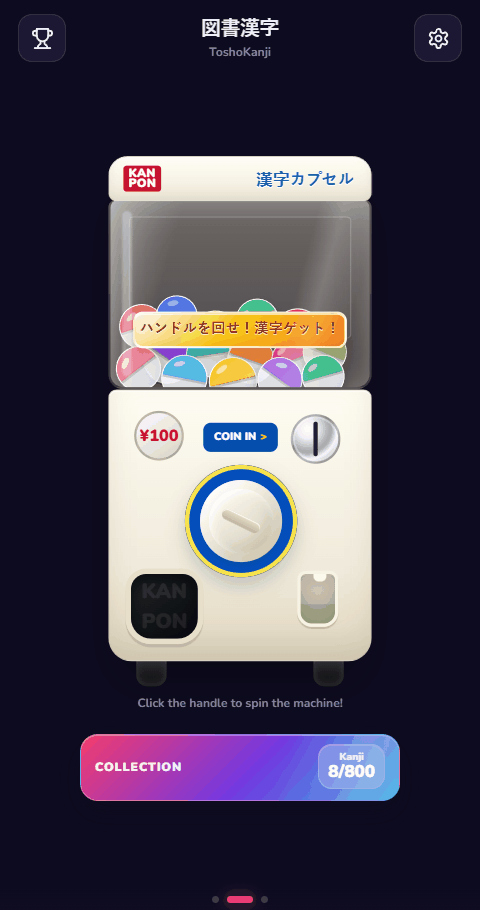
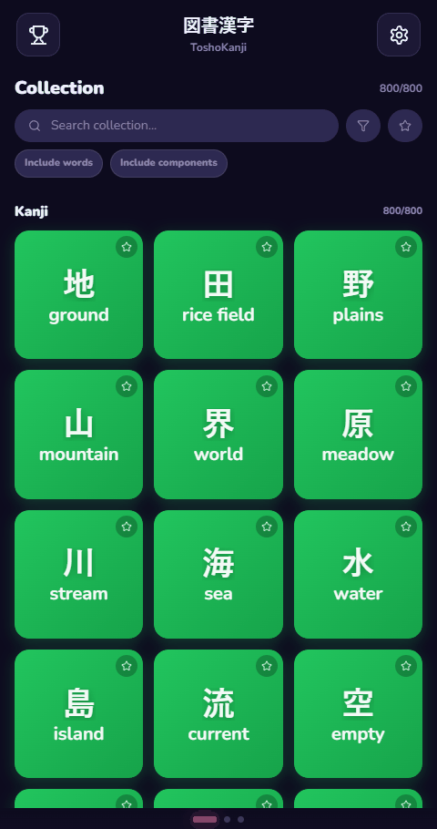

# ToshoKanji

ToshoKanji is a mobile-first kanji learning PWA where kanji behave like collectible entries. The app wraps a real kanji/vocabulary reference in a playful capsule-machine loop: unlock kanji, browse the collection, open rich entries, save personal notes, and follow vocabulary/component relationships as the library grows.

It is intentionally not a full Japanese dictionary or a heavy learning-management system. The product bet is smaller and more memorable: make kanji feel worth collecting, then make each collected entry useful enough to revisit.

## App Walkthroughs

| Gachapon-inspired Kanji Discovery | 800 and counting Kanji to discover |
| --- | --- |
|  |  |
| Pull the handle and get Kanji Capsules to add them to your collection. | New Kanji are being continuously added, with the goal of adding all 2136 Joyo Kanji. |

| Intuitive exploration system | Filtering System |
| --- | --- |
|  |  |
| Seamlessly jump from Kanji, to word, to Kanji, to Radical, and back again. Discover patterns and build your understanding at your own pace. | Filter through all the Kanji with an intuitive filtering system which lets you start small and grow big. |

## What It Does

- **Gacha-driven unlocks:** kanji are pulled from a rarity-weighted pool with a capsule-machine interaction, animated reward reveal, rarity rings, sparkles, and collection handoff states.
- **800-kanji collection:** the current generated dataset includes 800 kanji, organized by learner-facing categories and rarity tiers.
- **Collection browsing:** unlocked kanji appear as colorful cards with category colors, favorite stars, match reasons, and sparkle highlights for newly unlocked entries.
- **Search and filters:** collection search supports kanji, meanings, readings, custom names, components, and optional vocabulary results, with filters for category, rarity, JLPT level, and favorites.
- **Category stats:** the gacha page opens a capsule-style progress dashboard showing completion by category.
- **Entry pages:** kanji pages include meanings, readings, visible components, optional raw decomposition, related vocabulary, notes, custom names, favorites, and a contextual chat panel.
- **Related entries:** component and word pages let users move through the structure around a kanji instead of treating each character as an isolated flashcard.
- **Achievements:** milestone tracking covers first unlocks, rarity progress, category progress, favorites, notes, and full collection completion.
- **PWA polish:** install hints, app icons, manifest metadata, standalone viewport handling, and production service-worker caching are configured.

## Latest Implementation Highlights

This branch is more than a data bump. Recent work added:

- **Precomputed entry indexes** in `src/app/data/entryIndexes.ts` for fast lookup by id, rarity, radical, component, and category.
- **Richer gacha motion** with banked capsule visuals, dispensed capsule states, press-to-open reveal behavior, rarity-specific sparkle timing, and interaction locking so swipes do not fight an active spin.
- **Improved collection usability** with lazy vocabulary loading, async word search/favorites, filter badges, and better text fitting on dense cards.
- **Entry-state restoration** so kanji detail pages preserve scroll position, word-search text, and word-list scroll when navigating away and back.
- **Debounced persistence** with an explicit `pagehide` flush so local progress is saved without writing on every tiny state change.
- **Expanded achievement generation** from rarity/category metadata instead of only hand-authored one-off achievements.

## Dataset

The generated data is built from public dictionary sources:

- **KANJIDIC2** for kanji meanings, readings, grade/frequency/JLPT-style metadata.
- **JMdict_e** for vocabulary examples and word metadata.
- **RADKFILE/KRADFILE** for visual lookup groups, source display forms, and decomposition signals.

Current validation report:

- 800 kanji entries
- 800 curated Kanji entries
- 183 represented radical families
- 230 explorable radical/lookup-component pages
- 208,402 source-distinct JMdict spelling/reading records
- whole-dataset source validation passing

The app intentionally stores more than it shows by default. Kanji pages separate canonical radical classification from source-established visible shapes, and color visible shapes by evidence-backed role: official radical form, standalone KANJIDIC2 character, or lookup-only shape. A standalone character meaning is never presented as proof of that component's semantic role inside the larger Kanji. Raw decomposition and provenance-oriented details stay available where they help debugging or advanced review.

## Tech Stack

- React 18
- TypeScript
- Vite 6
- `vite-plugin-pwa`
- `motion`
- Radix UI primitives
- Lucide icons
- Tailwind CSS 4
- Python data-generation and validation scripts

## Architecture

```text
src/app/
  App.tsx                       # app shell, tabs, navigation, unlock flow, persistence wiring
  persistence.ts                # idle-scheduled, versioned progress/settings persistence
  personalStore.ts              # IndexedDB-backed notes and custom names
  data/wordStore.ts             # sharded dictionary installation and indexed queries
  wordSearch.worker.ts           # off-main-thread vocabulary search
  search/kanjiSearch.ts         # collection search index and scoring
  data/entryIndexes.ts          # precomputed maps/groupings over generated entries
  data/generated/               # compact generated kanji, radical, and component modules
public/data/words/              # versioned JSON vocabulary shards installed into IndexedDB
  data/ui/                      # achievements, category colors, prompts, mock AI replies
  components/                   # gacha machine, cards, stats modal, chat, PWA hint
  screens/                      # collection, entries, achievements, settings, practice placeholder
data/
  curated/                      # human-owned milestone membership and learning categories
  source-lock.json              # reviewed upstream URLs, hashes, sizes, and dates
scripts/
  build-kanji-data.py           # thin command-line entry point
  data_pipeline/                # modular KANJIDIC2/JMdict/RADK/KRAD parsing and generation
  validate-data.py              # pinned-source whole-dataset validation
  generate-icons.mjs            # PWA icon/favicon generation
```

Most product state currently lives in `App.tsx` and is passed down to screen components. Generated data and lookup/search helpers are split out so the UI can stay focused on interaction logic.

Vocabulary is stored as 32 versioned JSON shards rather than executable JavaScript. A versioned compact storage codec avoids repeating field names and provenance labels in every record; the app decodes it at the IndexedDB boundary into the same explicit source model used by the UI. The browser installs the shards incrementally, queries Kanji vocabulary through a multi-entry index, and scans full vocabulary search in a Web Worker.

Dataset membership and learning categories are deliberately separate from upstream dictionary facts. `data/curated/kanji-milestone.json` is the explicit list of ready characters, while `data/curated/learning-categories.json` preserves the author's hand-assigned categories. The development category picker writes only to that curated category file, and the generated Kanji module imports it directly for hot updates.

## Deployment

ToshoKanji builds as a static Vite PWA:

1. `npm run build` compiles the React app into `dist/`.
2. `vite-plugin-pwa` generates the manifest/service-worker assets.
3. The resulting `dist/` directory can be deployed to any static host.

Local production preview:

```powershell
npm run build
npm run preview
```

## Running Locally

Install Node.js LTS, then run:

```powershell
npm install
npm run dev
```

Vite usually serves the app at:

```text
http://localhost:5173/
```

If PowerShell blocks npm scripts on Windows:

```powershell
Set-ExecutionPolicy -Scope CurrentUser -ExecutionPolicy RemoteSigned
```

Close and reopen PowerShell afterward.

## Useful Scripts

```powershell
npm run dev            # start Vite dev server
npm run build          # create production PWA build
npm run preview        # serve the production build locally
npm run data:kanji     # regenerate from already pinned source files
npm run data:check     # rebuild in memory without changing generated files
npm run data:test      # run parser, restriction, codec, and romanization tests
npm run data:validate  # compare every generated record with a pinned-source rebuild
npm run data:refresh   # fetch current upstream files and intentionally update the source lock
npm run icons          # regenerate PWA, iOS, and favicon assets
```

## Design Source

The prototype began from this Figma design:

https://www.figma.com/design/2oZvSayfYzcQBdNLDGOxhJ/Kanji-Dictionary-App-Design
